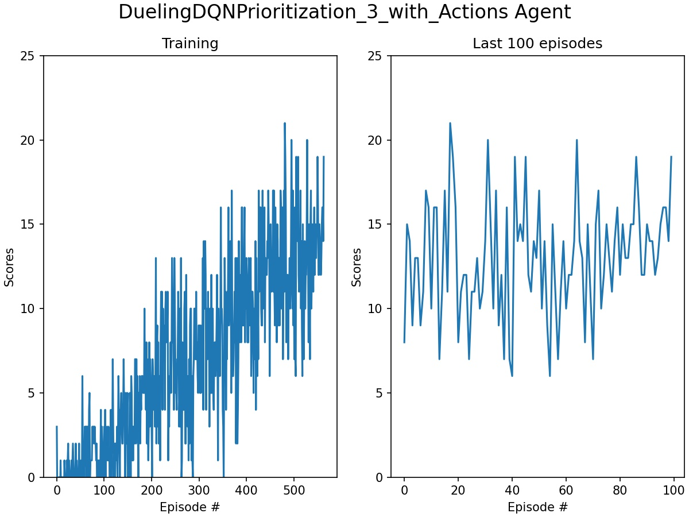

# Project 1 in Udacity Deep Reinforcement Learning Nanodegree - Navigation

### Introduction

This is the first project in the above mentioned nanodegree, in which we train an agent to navigate and collect bananas in a large, square world.

The game goes like this: A reward of +1 is provided for collecting a yellow banana, and a reward of -1 is provided for collecting a blue banana and the goal is to collect as many yellow bananas as possible without hitting blue bananas.

The state space has 37 dimensions, including the agent's velocity, together with ray-based perception of objects around agent's forward direction.  At each state, the agent has to learn how to best select one of the four discrete actions:

- **`0`** - move forward.
- **`1`** - move backward.
- **`2`** - turn left.
- **`3`** - turn right.

The task is episodic, and the target is to get an average score of +13 over 100 consecutive episodes.

### Setting up the system following the given instructions

To start with, you need to download and unzip the environment. You need to download the correct version for the platform you are using. The links for each of the system are given in the [project page](https://github.com/udacity/deep-reinforcement-learning/tree/master/p1_navigation). I installed on both Linux [from here](https://s3-us-west-1.amazonaws.com/udacity-drlnd/P1/Banana/Banana_Linux.zip) and 64 bits Windows [from here](https://s3-us-west-1.amazonaws.com/udacity-drlnd/P1/Banana/Banana_Windows_x86_64.zip). In both cases, there will be a directory with the executable and data, which I assume will be put in the same directory as the notebooks. In case of Windows, the name of the directory will be ```Banana_Windows_x86_64```
and for Linux ```Banana_Linux```. I have added two empty directories to have them visible.

To start the environment, you need to have the relative location of the Unity set correctly. If you follow the above instruction, on 64 bits machines with Windows it will be

```
env = UnityEnvironment(file_name="Banana_Windows_x86_64/Banana.exe")
```

and with Linux

```
env = UnityEnvironment(file_name="Banana_Linux/Banana.x86_64")
```

Initially, I met quite some difficulties before I could have the environment running on my system (Ubuntu 20.04). After that the environment started a black window appeared and then the execution was broken with error messages, which were somewhat difficult to understand. Finally, I figured out that my problem was related to incompatibility between Python version and unityagents. I created a conda environment with Python=3.6 and after activating the environment, I installed necessary packages. I.e.

```
conda create --name unity python=3.6
conda activate unity

pip install unityagents
pip install mlagents
pip install gym
pip install h5py
pip install Pillow
```

After that the notebook could run. Still a few points are worth mentioning. When the cell is executed, the Unity window opens and on a black background, it gives this message:

```
"Banana.x84_64" is not responding.
```

That is OK. Just let it be and continue execution of following cells. You should pass it by SHIFT ENTER or just running all the cells in the notebook. Also, I still had the following message in the terminal, where I started jupyter:

```
Unable to preload the following plugins:
 ScreenSelector.so
 libgrpc_csharp_ext.x86.so
```

and the following complain in Player.log

```
Fallback handler could not load library /home/abb001/git/deep-reinforcement-learning/p1_navigation/Banana_Linux/Banana_Data/Mono/libcoreclr.so
```

One last point worth of mentioning is a difference between Linux and Windows. On Windows I needed to cast the action to int when the environment was stepping forward, i.e.

```
env_info = env.step(int(action))[brain_name]
```

After these steps, I could move on to implement the algorithm.

### Implementation

Q-Learning refers to a class of algorithms for reinforcement learning, where the Q-function that predicts the maximum expected accumulated reward for each action at the current state is approximated in an iterative manner. In the original deep learning method, a deep network. called Deep Q-Network (DQN) was propoesd to estimate the Q-function. The iterative method can be described as following:

1. Set up a network for the Q-function, which estimates the expected reward for each action at a given state and initialize the parameters with a first random guess. Start at the initial state.
2. Use the network to find the rewards for each actions and select the action with maxium reward.
3. Take the greedy action and record the earned reward and the new state.
4. Calculate the expected maximum accumulated reward using the network.
5. Use the actual earned reward and the estimated maximum discounted future reward and estimate the target.
6. Update the weights so that the mean square error in a selected batch becomes smaller.
7. If the target is not achieved, go to point 2, above and continue to iterate.

The above steps describe the basic algorithm. There are a number of improvements that have been proposed and found to be useful, such as:

1. Experience Replay and Double Deep Q-Network and fixed target network. This will be the starting point in this project.
2. Prioritized Experience Replay, to be added.
3. Dueling Douple Q-Network, to be implemented.

My initial trainings indicated that the agent could become very skilful fast. However, it made mistakes and got stuck in some cases, mistakes that a human player will not commit. My thought was that we do not do such mistakes as we not only see the bananas, but also remember the latest states togther with our own actions. To test this idea, I considered two cases, one, when only the states are taken as input to the networks and one where I added the selected action to the state vector as a for of extended state and saved three stages of this extended state in a history buffer and used that as input to the networks.

Details of the algorithm can be found in [training_and_report.ipynb](./training_and_report.ipynb).

#### File structure

To run the training as well as tests, in addition to the notebook, three script files are needed:

1. [models.py](./models.py) implements two models, a simple fully connected network with 4 layers and a dueling network with one feature layer, three layers of advantage network and two layers of value network.
2. [replay_buffer.py](./replay_buffer.py) implements two buffers, one for simple replay of the experiences and one with prioritization.
3. [agents.py](./agents.py) implements three agents, simple DQN agent, DQN with prioritized experience replay and Dueling DQN with prioritized experience replay.

Running the training, i.e. the notebook [training_and_report.ipynb](./training_and_report.ipynb) trains the network and saves the networks in [./networks/.](./networks/.) and the figures in [./figs/.](./figs/.). [test.ipynb](./test.ipynb) uses the trained networks from [./networks/.](./networks/.) and saves the figures in [./figs/.](./figs/.).

### Training results

To train the agent, you can run the test using the notebook [training_and_report.ipynb](./training_and_report.ipynb). Below figures presented the result after that the average of score in the last 100 episodes has passed 13.

#### 1. Double Q-learning with Experience Replay

<figure class="image" style="display:inline-block">
  
</figure>

<figure class="image" style="display:inline-block">
  
</figure>

The networks used in these cases were the following:

One state as input:

```
QNetwork(
  (fc1): Linear(in_features=37, out_features=74, bias=True)
  (fc2): Linear(in_features=74, out_features=64, bias=True)
  (fc3): Linear(in_features=64, out_features=32, bias=True)
  (fc4): Linear(in_features=32, out_features=4, bias=True)
)
```

Three state together with actions as input:

```
QNetwork(
  (fc1): Linear(in_features=123, out_features=246, bias=True)
  (fc2): Linear(in_features=246, out_features=64, bias=True)
  (fc3): Linear(in_features=64, out_features=32, bias=True)
  (fc4): Linear(in_features=32, out_features=4, bias=True)
)
```

#### 2. Double Q-learning with Prioritized Experience Replay

<figure class="image" style="display:inline-block">
  
</figure>

<figure class="image" style="display:inline-block">
  
</figure>

Same networks as above were used here.

#### 3. Dueling Double Q-learning with Prioritized Experience Replay

<figure class="image" style="display:inline-block">
  
</figure>

<figure class="image" style="display:inline-block">
  
</figure>

The networks used in these cases were the following:

One state as input:

```
DuelingQNetwork(
  (feature): Sequential(
    (0): Linear(in_features=37, out_features=74, bias=True)
    (1): ReLU()
  )
  (advantage): Sequential(
    (0): Linear(in_features=74, out_features=64, bias=True)
    (1): ReLU()
    (2): Linear(in_features=64, out_features=32, bias=True)
    (3): ReLU()
    (4): Linear(in_features=32, out_features=4, bias=True)
  )
  (value): Sequential(
    (0): Linear(in_features=74, out_features=64, bias=True)
    (1): ReLU()
    (2): Linear(in_features=64, out_features=1, bias=True)
  )
)
```

Three state together with actions as input:

```
DuelingQNetwork(
  (feature): Sequential(
    (0): Linear(in_features=123, out_features=246, bias=True)
    (1): ReLU()
  )
  (advantage): Sequential(
    (0): Linear(in_features=246, out_features=64, bias=True)
    (1): ReLU()
    (2): Linear(in_features=64, out_features=32, bias=True)
    (3): ReLU()
    (4): Linear(in_features=32, out_features=4, bias=True)
  )
  (value): Sequential(
    (0): Linear(in_features=246, out_features=64, bias=True)
    (1): ReLU()
    (2): Linear(in_features=64, out_features=1, bias=True)
  )
)
```

### Test results

The notebook [test.ipynb](./test.ipynb) is prepared for testing with trained network loaded from [./networks/.](./networks/.). The results for execution of 20 times of testing is presented below.

#### 1. Double Q-learning with Experience Replay

<figure class="image" style="display:inline-block">
  
</figure>

<figure class="image" style="display:inline-block">
  
</figure>

#### 2. Double Q-learning with Prioritized Experience Replay

<figure class="image" style="display:inline-block">
  
</figure>

<figure class="image" style="display:inline-block">
  
</figure>

#### 3. Dueling Double Q-learning with Prioritized Experience Replay

<figure class="image" style="display:inline-block">
  
</figure>

<figure class="image" style="display:inline-block">
  
</figure>

### Observations, conclusions and further improvements

Although the tests are not covering all aspects, a rough picture will be that use of history improves the learning and results of the game. The agent trained with 3 steps of states and its own actions behaves in a more stable manner. It is difficult to judge whether with the current choice of hyper parameters the prioritization of the expareiences, as well as use of dueling network give any positive contribution alone, when only one state is considered. However, when the history is considered, the results becomes better with dueling network and experience prioritization.

I have an impression that results of the tests were not we good as what could be expected from the last 100 episodes.

The idea of making use of the historical data and also involving the previous commands as input to the network seems to help the agent to become more competent. This can be further developed. The feature extraction can be more advanced than only one fully connected layer.

### Acknowldgement

I had great advantage from going through the implementation and the code presented [here](https://github.com/higgsfield/RL-Adventure).
